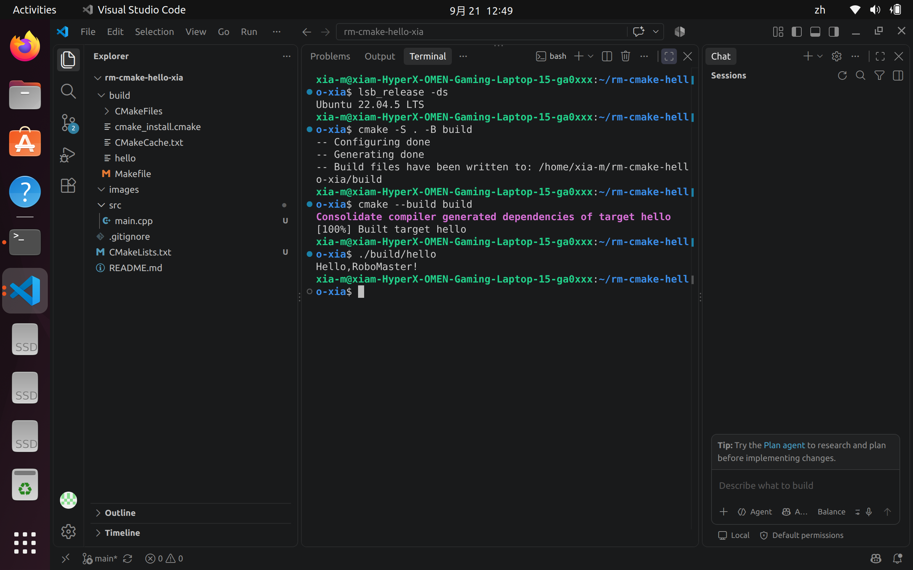

# rm-cmake-hello-xia
RoboMaster算法组CMake HelloWorld作业

## 环境
Ubuntu 22.04 LTS

## 编译运行步骤
```bash
cmake -S . -B build
cmake --build build
./build/hello
```

## 运行结果截图


This project is built on Ubuntu 22.04 with CMake and C++