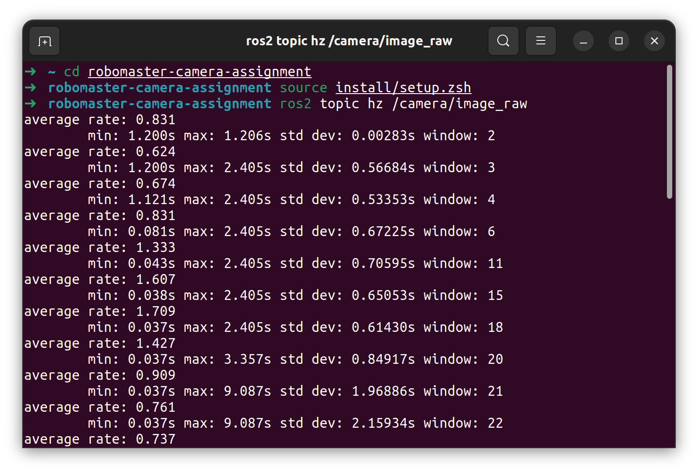
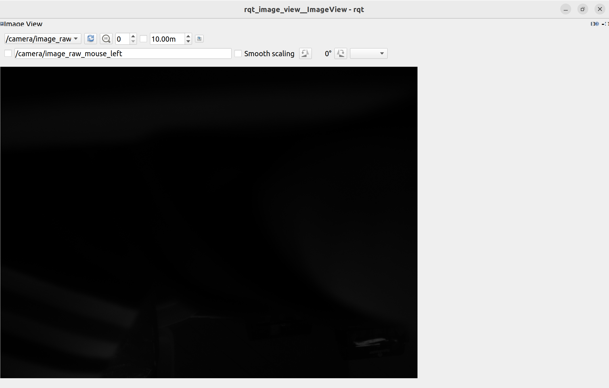
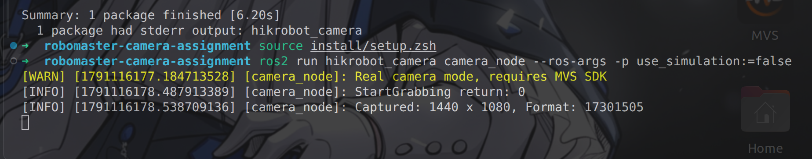
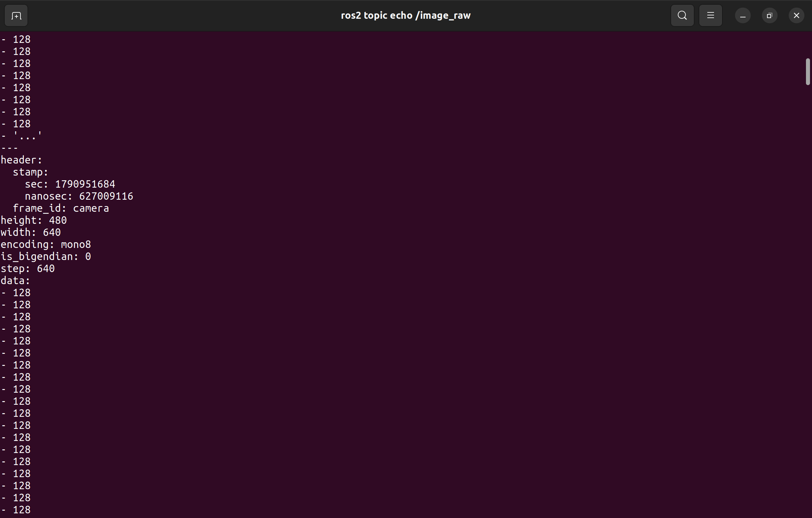
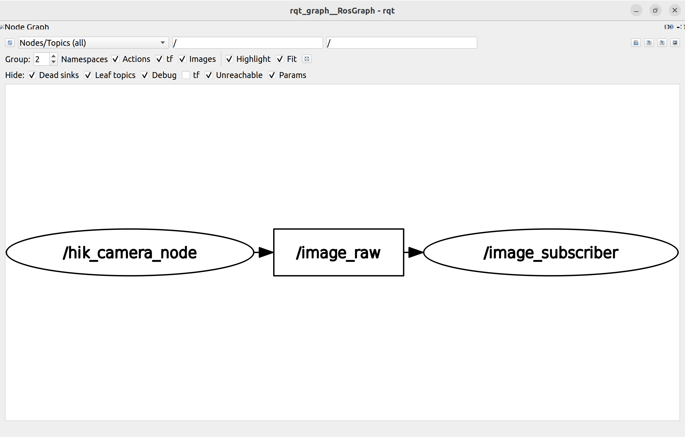
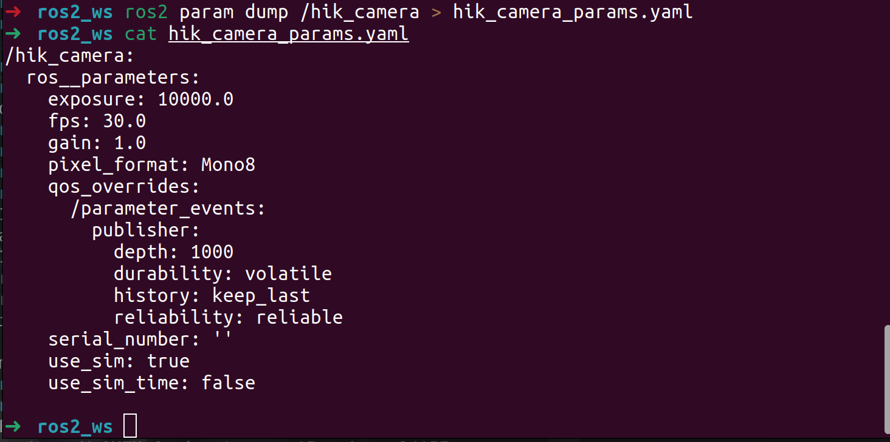

<<<<<<< HEAD
## 第四次培训
# 文件结构
```bash
.rm_yolo_project
├── all_data
│   ├── images
│   │   └── images
│   └── labels
│       └── labels
├── create_empty_label.py
├── README.md
├── rm_dataset
│   ├── images
│   │   ├── test
│   │   ├── train
│   │   └── val
│   └── labels
│       ├── test
│       ├── train
│       ├── train.cache
│       ├── val
│       └── val.cache
├── rm_data.yaml
├── runs
│   └── detect
│       ├── predict
│       ├── predict-2
│       └── predict-3
├── split_data.py
├── weights
│   └── yolo26n.pt
├── yolo26n.pt
├── yolov8s.pt
├── 夏雨晨.pt
│   ├── yolo26n_train_result
│   └── yolov8s_train_result
└── 第四次培训.odt
rm_yolo_project/rm_dataset/images/train/images为原文件中unlabeled中的文件
rm_yolo_project/rm_dataset/labels/train/labels为上面文件的对应txt文件
```
=======
# hik_camera：海康MVS SDK ROS2 Humble功能包
## 功能
1. 枚举、连接海康USB/GigE相机
2. 断线自动重连
3. 采集图像，发布sensor_msgs/Image话题 `/image_raw`
4. ROS参数动态配置曝光、增益、帧率、像素格式
5. 支持仿真模式，无实体相机也能运行

## 环境
Ubuntu22.04 + ROS2 Humble + MVS SDK

## 编译
```bash
cd ~/ros2_ws
colcon build --packages-select hik_camera
source install/setup.zsh
```
## 仿真模式
# 启动图像发布节点
```bash
ros2 run hik_camera hik_camera_node --ros-args -p use_sim:=true
```
# 启动图像订阅节点
```bash
source install/setup.zsh
ros2 run hik_camera image_sub
```
## 真实相机模式
# 启动图像发布节点
```bash
ros2 run hik_camera hik_camera_node --ros-args -p use_sim:=false
```
# 查看话题列表
```bash
ros2 topic list
```
# 查看话题消息
```bash
ros2 topic echo /image_raw
```

## 图片











>>>>>>> bf87e95aeb941f6faf2b412830aba1fd925e9cad
